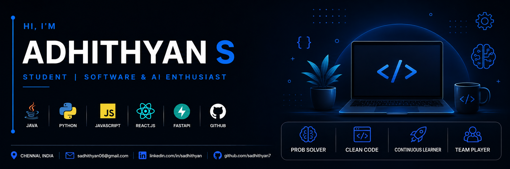

  

## 👋 Hi there, I'm Adhithyan

I am an Electronics and Communication Engineering undergraduate building software, designing intuitive interfaces, and constantly practicing my problem-solving skills. 

- 🎓 3rd-year B.E. ECE student (2023–2027).
- 💼 Previously interned at **Hitachi Energy** (Python automation).
- ☁️ Certified in **Microsoft Azure Fundamentals** & **Salesforce Agentforce Specialist**.
- 🌱 Currently focused on mastering Data Structures & Algorithms in Java.
- 🤝 Club Secretary for the Rotaract Club (planning events and community leadership).

<h3 align="center">🛠️ Languages and Tools:</h3>

  
  
  
  
  
  
  
  

<h3 align="center">Activity & Progress:</h3>

## Featured Projects

| Project | Description |
|---------|-------------|
| **[Jarvis-Voice-Assistant](https://github.com/sadhithyan7/Jarvis-Voice-Assistant)** | A local desktop voice assistant built with Python and the google-genai SDK. |
| **[ticket-to-faq-pipeline](https://github.com/sadhithyan7/ticket-to-faq-pipeline)** | An automated pipeline for processing and converting support tickets into FAQ documentation. |
| **[Paper-Explainer](https://github.com/sadhithyan7/Paper-Explainer)** | A RAG tool to designed to simplify, summarize, and extract insights from academic research papers. |

<h3 align="center">📫 Connect With Me:</h3>

  
  

<!--
**sadhithyan7/sadhithyan7** is a ✨ _special_ ✨ repository because its `README.md` (this file) appears on your GitHub profile.

Here are some ideas to get you started:

- 🔭 I’m currently working on ...
- 🌱 I’m currently learning ...
- 👯 I’m looking to collaborate on ...
- 🤔 I’m looking for help with ...
- 💬 Ask me about ...
- 📫 How to reach me: ...
- 😄 Pronouns: ...
- ⚡ Fun fact: ...
-->
